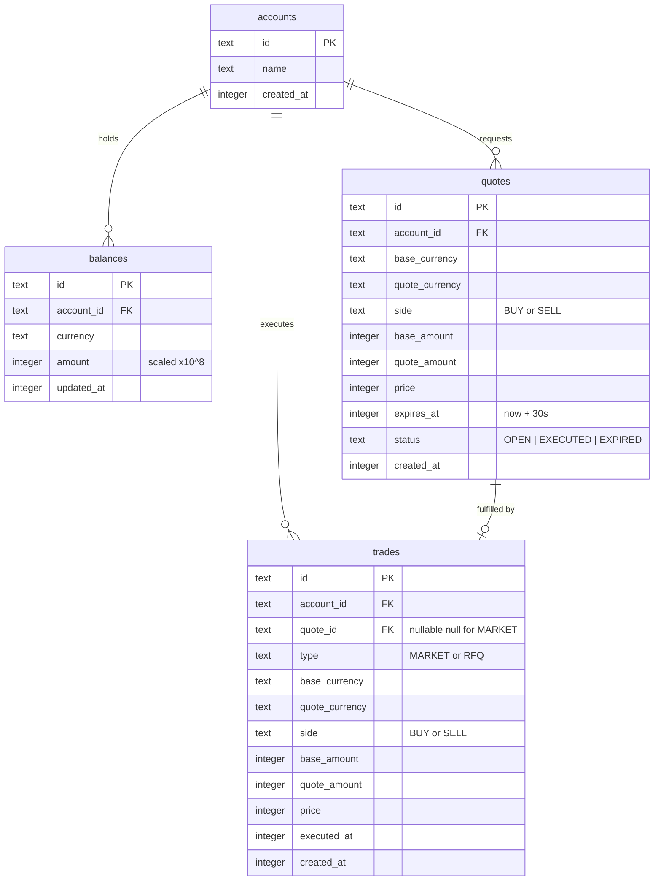

# MiniOpenFX

[](https://github.com/4NNNN/mini-openfx/actions/workflows/ci.yml)

A minimal, readable FX quoting and trading API

**Live API:** https://mini-openfx-production.up.railway.app

---

## Submission Details

- **Code Repository**: Full working source code available on GitHub.
- **Documentation**: This README explains all architecture choices and trade-offs.
- **Automated CI**: GitHub Actions workflow passes correctly and is visibly badged.

---

## Quick Start

```bash
bun install
bun run db:seed
bun run dev
```

Requires [Bun](https://bun.sh) v1.0+. SQLite is bundled natively so no external database is needed.

---

## What It Does

- **Live prices** - Proxies Binance bid and ask for supported pairs with a 5 second cache.
- **Quote Selection (Not Smart Order Routing)** - Aggregates quotes from multiple liquidity providers, selects the best rate for the customer, and executes the order at that single best venue. This is NOT split order routing. We execute at the single best venue, not split orders across multiple venues.
- **RFQ quotes** - Locks a spread adjusted price for 30 seconds before execution.
- **Market trades** - Executes immediately at live mid price with no quote required.
- **Balance tracking** - Per currency ledger updated atomically on every trade.
- **Trade history** - Full record with side, type, price, and both currency amounts.

---

## Stack & Scope

The assignment asked to focus on clarity, correctness, and simplicity over completeness. The stack was chosen to reflect exactly that. Every tool is proportional to the problem, so the evaluation can focus on product thinking, API design, and financial modelling rather than infrastructure configuration.

This is a focused API with four core functions and two currency pairs. Reaching for Express, Postgres, Redis, and JWT would be an overkill. Instead:

- **Bun**: Runs HTTP natively via `Bun.serve` so no framework is needed for a five route API.
- **SQLite**: Handles persistence with zero ops overhead requiring no server, no connection pool, and no configuration.
- **Drizzle**: Gives type safe queries without hiding the SQL, which matters when atomicity is critical.
- **In memory Maps**: Serve as the rate limiter and price cache providing clean and sufficient usage for a single process. **The reason I implemented the rate limiter with an array and not a double ended queue(overkill)**, was to explore and solve the same question which was asked to me in the previous interview round.
- **Header based auth**: Keeps the domain logic free of token concerns making it easy to read and test.

The result is a codebase where every line is either business logic or directly serving it.

---

## Architecture & Trade-offs

What was built, the trade off it carries, and the production correct upgrade path.

---

### 1. Server Logic — RFQ, No Quote Push

**What is implemented:** `POST /api/v1/quotes` locks a price for 30 seconds and returns immediately. The quote is never pushed back to the client when it expires or changes — the client must poll `GET /api/v1/quotes/:id`. The quote execution in `executeTradeTx` is a synchronous SQLite transaction: debit, credit, mark executed, and insert trade, all committed or rolled back together in one `sqlite.transaction()` call.

- The RFQ quote is fetch-and-forget. There is no WebSocket, no SSE push, and no server-side expiry job. The server marks a quote `EXPIRED` lazily only when the client tries to execute it past the deadline.
- This avoids the complexity of a background scheduler, a pubsub channel, and client side reconnection logic. For a 30-second TTL that is polled at execution time, lazy expiry is correct.
- At scale, a real RFQ system streams quote updates over WebSocket so the client always holds the current price. The server runs a ticker that recomputes the quote mid as the market moves and broadcasts changes. The upgrade path here is an SSE endpoint per quote ID with a dedicated heartbeat goroutine/process.

---

### 2. Rate Limiting — Sliding Window over a Timestamp Array

**What is implemented:** `RateLimiter` tracks per account request timestamps in a plain `Array`. On each call, timestamps older than the 60 second window are evicted from the front with `shift()`, and the remaining count is checked against the 60 request limit.

- This is the Sliding Window algorithm, most accurate of the five canonical options (Leaky Bucket, Token Bucket, Fixed Window, Sliding Log, Sliding Window). Fixed Window has a boundary vulnerability where a client can burst 2× the limit by firing at the tail of one window and the head of the next and sliding Window eliminates that.
- `Array.shift()` is O(n) on every check. A double ended queue would give O(1) head removal, which matters when a single account can have hundreds of timestamps in the window.
- The limiter lives in process memory. A load balancer with two nodes gives each account two independent counters, making the per account cap bypassable. The production fix is a Redis sorted set with an atomic Lua script: `ZREMRANGEBYSCORE` removes stale entries, `ZCARD` returns the count, and `ZADD` appends the new timestamp, all in one round trip with no race.

---

### 3. Price Aggregation — Best Quote Selection

**What is implemented:** `getBestQuote` in `sor.service.ts` fires `Promise.allSettled` against three sources (Binance real, MassiveFX mocked at ±0.01%, CoinGecko mocked at ±0.02%). The fulfilled quotes are collected into an array and sorted: ascending ask for BUY, descending bid for SELL. The first element wins.

- `Array.sort` on three elements is effectively O(1) in practice, but the algorithm is O(n log n) for n venues. More critically sorting materialises all quotes before picking one, a linear scan with a running best would be O(n) with no allocation overhead.
- A production SOR aggregator uses a min heap (priority queue) keyed on ask for BUY or bid for SELL. New venue quotes are pushed into the heap as they arrive; the best is always at the root in O(1). This also lets the aggregator stream partial results, return the best available quote after 80ms even if one slow venue has not responded rather than waiting for `allSettled`.

---

### 4. ACID Consistency — Atomic Debit as the Overdraft Guard

**What is implemented:** Every trade runs inside `sqlite.transaction()`. The balance debit is a single `UPDATE` with the sufficiency check in the `WHERE` clause not a read followed by a conditional write. The quote status flip from `OPEN` to `EXECUTED` is a guarded `UPDATE WHERE status = 'OPEN'`. If zero rows change, the trade is rejected before any balance moves.

```sql
UPDATE balances SET amount = amount - ?
WHERE account_id = ? AND currency = ? AND amount >= ?
```

- There is no gap between a balance read and a balance write. The check and the mutation are one atomic SQL statement. This is the textbook ACID isolation pattern: if two concurrent requests arrive for the same account, SQLite serialises writes.
- The alternative, read balance in JS, check in application code, then write, is a read-modify-write cycle with a race window in the gap. Under concurrent load this produces double spends. This is the BASE model and it is a fatal flaw in any ledger.
- At Postgres scale, row-level locks via `SELECT FOR UPDATE` or `FOR UPDATE SKIP LOCKED` give the same guarantee with MVCC concurrency. For event sourced systems, the debit becomes an append to an immutable ledger and the balance is a materialised view derived from the event log which makes replays, audits, and rollbacks first class operations.

---

### 5. SQLite in WAL Mode

**What is implemented:** Drizzle ORM on top of Bun's native `bun:sqlite`. WAL (Write-Ahead Log) mode is enabled so readers never block writers and writers never block readers. All schema changes are managed through Drizzle migrations.

- WAL mode allows any number of concurrent reads alongside a single write. On a single server this is sufficient trades serialise through the write lock and price reads proceed unblocked. The network hop to a remote database is eliminated entirely.
- SQLite uses a database level write lock. Postgres uses MVCC with row-level locking so thousands of writers can proceed simultaneously without blocking each other. At high write concurrency — hundreds of trades per second from multiple accounts — SQLite's single write lock becomes the throughput ceiling.
- The upgrade path is a drop in swap at the Drizzle layer: replace `drizzle(sqlite)` with `drizzle(pg)` and update the schema dialect. The service layer does not change. Postgres with a connection pool (PgBouncer in transaction mode) and a read replica handles horizontal read scaling. At higher volume still, the balance table shards by `account_id` using hash partitioning so write locks are per shard rather than global(Postgres handled sharding, collision techniques as well as partitioning internally).

---

## How Trades Stay Correct

I implemented the double entry accounting concept which I diagramatically applied for the OpenFX's Pay-in's product implementation.

Two patterns handle correctness under concurrent load:

**Atomic balance debit**: The check and the write are a single statement.
```sql
UPDATE balances
SET amount = amount - ?
WHERE account_id = ? AND currency = ? AND amount >= ?
```
The guard is inside the `WHERE` clause instead of application code before the query. If the balance is insufficient, zero rows match and no rows are changed. There is no gap between a read and a write where a concurrent request can race in and overdraft the account.

**Quote execution**: Status transition is a conditional update.
```sql
UPDATE quotes SET status = 'EXECUTED'
WHERE id = ? AND status = 'OPEN' AND expires_at > ?
```
Only one caller can flip the quote from `OPEN` to `EXECUTED`. Anyone else is rejected before any balance is touched. The debit, credit, quote update, and trade insert all run inside a single SQLite transaction so any failure rolls everything back.

**API Idempotency:** The API requires an `X-Idempotency-Key` header for `POST /api/v1/trades`. An in-memory cache checks and resolves duplicate or retried concurrent requests, safely mapping them to the exact same trade promise without complex database schema constraints.

---

## Database Schema



---

## API Reference

All responses return standard formats:
```json
{ "data": { ... } }
{ "error": { "code": "...", "message": "..." } }
```

Auth required on all endpoints except `/health` and `/api/v1/prices`:
```
X-Account-Id: <account-uuid>
```
`POST /api/v1/trades` additionally requires an `X-Idempotency-Key` header (e.g., a UUID) to safely prevent duplicate executions during network retries.

| Method | Path | Description |
|---|---|---|
| `GET` | `/health` | Health check |
| `GET` | `/api/v1/prices` | All pair prices (bid, ask, mid) |
| `GET` | `/api/v1/prices/:pair` | Single pair `EUR_USDT` |
| `GET` | `/api/v1/balances` | Your balances per currency |
| `POST` | `/api/v1/quotes` | Request a locked 30s quote |
| `GET` | `/api/v1/quotes/:id` | Fetch a quote by ID |
| `POST` | `/api/v1/trades` | Execute a market or RFQ trade |
| `GET` | `/api/v1/trades` | Your trade history |
| `GET` | `/api/v1/trades/:id` | Single trade by ID |

**Supported pairs:** `EUR_USDT`, `BTC_USDT`

### Example Usage

**1. Generate a Quote (RFQ)**
```bash
curl -X POST http://localhost:3000/api/v1/quotes \
  -H "X-Account-Id: demo-account" \
  -H "Content-Type: application/json" \
  -d '{
    "baseCurrency": "EUR",
    "quoteCurrency": "USDT",
    "side": "BUY",
    "amount": 100
  }'
```

**2. Execute Trade at Locked Quote Price**
```bash
curl -X POST http://localhost:3000/api/v1/trades \
  -H "X-Account-Id: demo-account" \
  -H "X-Idempotency-Key: $(uuidgen)" \
  -H "Content-Type: application/json" \
  -d '{
    "type": "RFQ",
    "quoteId": "550e8400-e29b-41d4-a716-446655440000"
  }'
```

**3. Execute Trade at Live Price (Market Order)**
```bash
curl -X POST http://localhost:3000/api/v1/trades \
  -H "X-Account-Id: demo-account" \
  -H "X-Idempotency-Key: $(uuidgen)" \
  -H "Content-Type: application/json" \
  -d '{
    "type": "MARKET",
    "baseCurrency": "EUR",
    "quoteCurrency": "USDT",
    "side": "BUY",
    "amount": 100
  }'
```

### Error Codes

| Code | HTTP | When |
|---|---|---|
| `VALIDATION_ERROR` | 400 | Bad request body |
| `UNAUTHORIZED` | 401 | Missing account header |
| `NOT_FOUND` | 404 | Resource doesn't exist |
| `INSUFFICIENT_BALANCE` | 400 | Not enough funds |
| `QUOTE_EXPIRED` | 400 | Quote TTL has passed |
| `QUOTE_ALREADY_EXECUTED` | 409 | Quote already used |
| `PAIR_NOT_SUPPORTED` | 400 | Unsupported currency pair |
| `RATE_LIMITED` | 429 | Too many requests (60/60s per account) |
| `PRICE_FETCH_FAILED` | 502 | Binance unreachable |

---

## Tests

```bash
bun test
```
- **money.test.ts**: Scaled integer arithmetic and BigInt overflow edge cases.
- **services.test.ts**: Balance operations, quote lifecycle, and trade execution against in memory SQLite.
- **api.test.ts**: End to end integration tests against the live server requiring network.