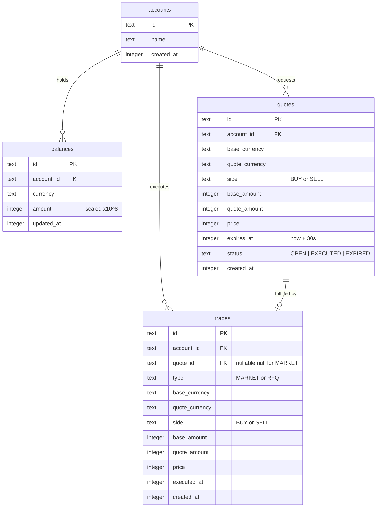

# MiniOpenFX

[](https://github.com/4NNNN/mini-openfx/actions/workflows/ci.yml)

A minimal, readable FX quoting and trading API. Built to be correct, not complex.

**Live API:** *[Public deployment URL to be added]*

---

## Submission Details

**Code Repository**: Full working source code available on GitHub.
**Documentation**: This README explains all architecture choices and trade-offs.
**Automated CI**: GitHub Actions workflow passes correctly and is visibly badged.

---

## Quick Start

```bash
bun install
bun run db:seed
bun run dev
```

Requires [Bun](https://bun.sh) v1.0+. SQLite is bundled natively so no external database is needed.

---

## What It Does

**Live prices**: Proxies Binance bid and ask for supported pairs with a 5 second cache.
**RFQ quotes**: Locks a spread adjusted price for 30 seconds before execution.
**Market trades**: Executes immediately at live mid price with no quote required.
**Balance tracking**: Per currency ledger updated atomically on every trade.
**Trade history**: Full record with side, type, price, and both currency amounts.

---

## Stack & Scope

The assignment asked to focus on clarity, correctness, and simplicity over completeness. The stack was chosen to reflect exactly that. Every tool is proportional to the problem, so the evaluation can focus on product thinking, API design, and financial modelling rather than infrastructure configuration.

This is a focused API with four core functions and two currency pairs. Reaching for Express, Postgres, Redis, and JWT would be an overkill. Instead:

**Bun**: Runs HTTP natively via `Bun.serve` so no framework is needed for a five route API.
**SQLite**: Handles persistence with zero ops overhead requiring no server, no connection pool, and no configuration.
**Drizzle**: Gives type safe queries without hiding the SQL, which matters when atomicity is critical.
**In memory Maps**: Serve as the rate limiter and price cache providing clean and sufficient usage for a single process. The reason I implemented the rate limiter with an array and not a double ended queue(overkill), was to explore and solve the same question which was asked to me in the previous interview round.
**Header based auth**: Keeps the domain logic free of token concerns making it easy to read and test.

The result is a codebase where every line is either business logic or directly serving it.

---

## Architecture & Trade-offs

These are the genuine trade offs made, and why they were the right call for this scope.

### 1. SQLite over Postgres: Zero ops vs Concurrency

**What was chosen:** Embedded SQLite in WAL mode.
**What you gain:** Zero ops deployment without a server process, no network hop to the DB, and no connection pool to configure. WAL mode allows concurrent reads alongside writes and delivers fast sequential write throughput on a single server.
**What you give up:** SQLite uses database level write locks, so concurrent write threads queue behind each other. Postgres uses MVCC (Multi-Version Concurrency Control) with row level locking, which allows thousands of users to write simultaneously without blocking. For this scope representing a single server deployment evaluated for correctness, SQLite is the right call. Postgres earns its complexity when horizontal scaling is actually required.

### 2. Scaled Integers over Floats: Correctness vs Simplicity

**What was chosen:** All monetary amounts stored as `amount × 10^8` integers, with `BigInt` for intermediate multiplication.
**What you gain:** Absolute mathematical correctness. IEEE 754 floating point arithmetic is not safe for financial ledgers because precision loss is a fatal flaw in a double entry system. Scaled integers make every rounding decision deterministic.
**What you give up:** Code simplicity. Every amount must be serialized to scaled form on the way in and deserialized to a decimal string on the way out. BigInt adds verbosity throughout. The verbosity is load bearing though because a large trade would silently overflow `Number.MAX_SAFE_INTEGER` using regular numbers.

### 3. In Memory Maps over Redis: Speed vs Scalability

**What was chosen:** The sliding window rate limiter and price cache both live in plain `Map` objects inside the Bun process.
**What you gain:** O(1) access with zero infrastructure dependency, meaning no Redis server, no network round trip, and no serialization cost.
**What you give up:** State is tied to the process so a restart clears both the rate limit history and the price cache. You also cannot horizontally scale since each server instance would maintain independent counters, making the per account limit bypassable behind a load balancer. Redis is the correct fix when that becomes a real requirement.

### 4. Bun.serve over Express: Control vs Ecosystem

**What was chosen:** Bun native HTTP server with a hand rolled router.
**What you gain:** A small attack surface, low memory footprint, and complete visibility into the request lifecycle. Every route, middleware, and error handler is readable in full.
**What you give up:** The ecosystem. Express and NestJS bring pre built auth guards, validation decorators, logging middleware, and a large plugin community. For a four function API, that ecosystem adds more surface area than the core logic so it is not a trade worth making here.

### 5. Header Auth over JWT: Testability vs Production Security

**What was chosen:** A plain `X-Account-Id` header is used as an auth stub.
**What you gain:** The domain layer concerning quoting, balance debits, and double entry inserts has zero opinion about how the account ID was obtained. Service logic is cleanly testable without mocking token libraries or managing signing keys in tests.
**What you give up:** Production readiness. The header is fully trusted with no signature verification. Real token validation would slot in at the middleware layer without touching any service code, but it needs to be there before this handles real money.

---

## How Trades Stay Correct

I implemented the double entry accounting concept which I diagramatically applied for the OpenFX's Pay-in's product implementation.

Two patterns handle correctness under concurrent load:

**Atomic balance debit**: The check and the write are a single statement.
```sql
UPDATE balances
SET amount = amount - ?
WHERE account_id = ? AND currency = ? AND amount >= ?
```
The guard is inside the `WHERE` clause instead of application code before the query. If the balance is insufficient, zero rows match and no rows are changed. There is no gap between a read and a write where a concurrent request can race in and overdraft the account.

**Quote execution**: Status transition is a conditional update.
```sql
UPDATE quotes SET status = 'EXECUTED'
WHERE id = ? AND status = 'OPEN' AND expires_at > ?
```
Only one caller can flip the quote from `OPEN` to `EXECUTED`. Anyone else is rejected before any balance is touched. The debit, credit, quote update, and trade insert all run inside a single SQLite transaction so any failure rolls everything back.

---

## Database Schema



---

## API Reference

All responses return standard formats:
```json
{ "data": { ... } }
{ "error": { "code": "...", "message": "..." } }
```

Auth required on all endpoints except `/health` and `/api/v1/prices`:
```
X-Account-Id: <account-uuid>
```

| Method | Path | Description |
|---|---|---|
| `GET` | `/health` | Health check |
| `GET` | `/api/v1/prices` | All pair prices (bid, ask, mid) |
| `GET` | `/api/v1/prices/:pair` | Single pair `EUR_USDT` |
| `GET` | `/api/v1/balances` | Your balances per currency |
| `POST` | `/api/v1/quotes` | Request a locked 30s quote |
| `GET` | `/api/v1/quotes/:id` | Fetch a quote by ID |
| `POST` | `/api/v1/trades` | Execute a market or RFQ trade |
| `GET` | `/api/v1/trades` | Your trade history |
| `GET` | `/api/v1/trades/:id` | Single trade by ID |

**Supported pairs:** `EUR_USDT`, `BTC_USDT`

### Example Usage

**1. Generate a Quote (RFQ)**
```bash
curl -X POST http://localhost:3000/api/v1/quotes \
  -H "X-Account-Id: demo-account" \
  -H "Content-Type: application/json" \
  -d '{
    "baseCurrency": "EUR",
    "quoteCurrency": "USDT",
    "side": "BUY",
    "amount": 100
  }'
```

**2. Execute Trade at Locked Quote Price**
```bash
curl -X POST http://localhost:3000/api/v1/trades \
  -H "X-Account-Id: demo-account" \
  -H "Content-Type: application/json" \
  -d '{
    "type": "RFQ",
    "quoteId": "550e8400-e29b-41d4-a716-446655440000"
  }'
```

**3. Execute Trade at Live Price (Market Order)**
```bash
curl -X POST http://localhost:3000/api/v1/trades \
  -H "X-Account-Id: demo-account" \
  -H "Content-Type: application/json" \
  -d '{
    "type": "MARKET",
    "baseCurrency": "EUR",
    "quoteCurrency": "USDT",
    "side": "BUY",
    "amount": 100
  }'
```

### Error Codes

| Code | HTTP | When |
|---|---|---|
| `VALIDATION_ERROR` | 400 | Bad request body |
| `UNAUTHORIZED` | 401 | Missing account header |
| `NOT_FOUND` | 404 | Resource doesn't exist |
| `INSUFFICIENT_BALANCE` | 400 | Not enough funds |
| `QUOTE_EXPIRED` | 400 | Quote TTL has passed |
| `QUOTE_ALREADY_EXECUTED` | 409 | Quote already used |
| `PAIR_NOT_SUPPORTED` | 400 | Unsupported currency pair |
| `RATE_LIMITED` | 429 | Too many requests (60/60s per account) |
| `PRICE_FETCH_FAILED` | 502 | Binance unreachable |

---

## Tests

```bash
bun test
```

**money.test.ts**: Scaled integer arithmetic and BigInt overflow edge cases.
**services.test.ts**: Balance operations, quote lifecycle, and trade execution against in memory SQLite.
**api.test.ts**: End to end integration tests against the live server requiring network.